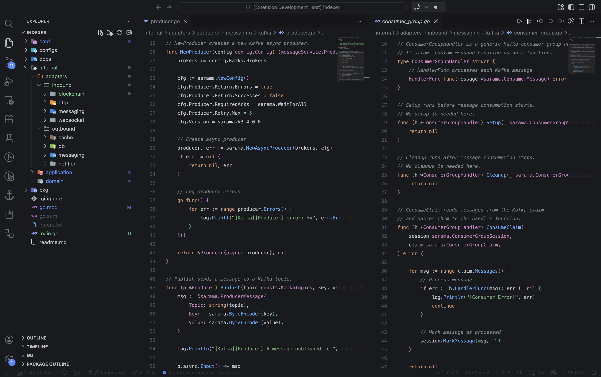

# Midnight Beach Dark Theme

A clean, aesthetic and calming dark theme for VS Code, inspired by midnight beaches.

---

## ✨ Features

* 🌊 Soft, ocean-inspired color palette
* 🌙 Calm and distraction-free UI
* 💻 Optimized for long coding sessions
* 🎯 Balanced contrast for readability

---

## 👀 Preview

---

## Installation

1. Open **Extensions** in VS Code
2. Search for **Midnight Beach**
3. Click **Install**
4. Go to **Color Theme** → Select **Midnight Beach**

---

## 📄 License

MIT © pawannn
